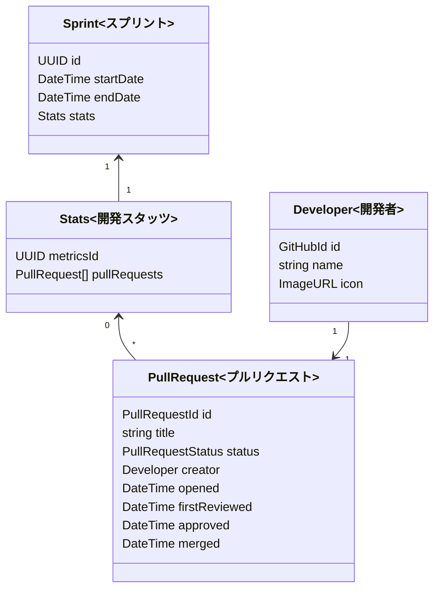

# ドメインモデル図

```mermaid
classDiagram
    class Sprint~スプリント~ {
        UUID id
        DateTime startDate
        DateTime endDate
        Stats stats
    }

    class Developer~開発者~ {
        GitHubId id
        string name
        ImageURL icon
    }

    class Stats~開発スタッツ~ {
        UUID metricsId
        PullRequest[] pullRequests
    }

    class PullRequest~プルリクエスト~ {
        PullRequestId id
        string title
        PullRequestStatus status
        Developer creator
        DateTime opened
        DateTime firstReviewed
        DateTime approved
        DateTime merged
    }

    Sprint "1" <-- "1" Stats
    Stats "0" <-- "*" PullRequest
    Developer "1" --> "1" PullRequest
```